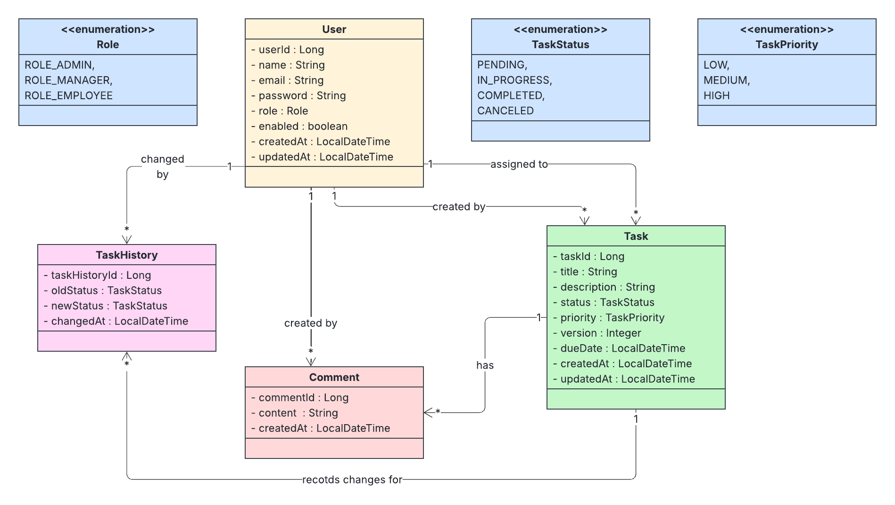
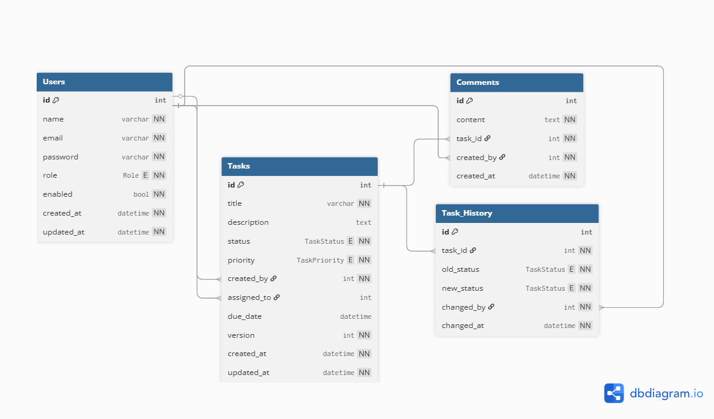

# Task Management System (TMS) Backend
<p align="center">


</p>

A Task Management System backend built with Spring Boot, JWT authentication, and RESTful APIs. This project allows users to manage tasks, comments, and track task history efficiently. Designed as a portfolio project, it demonstrates solid backend practices including DTO validation, JWT authentication and authorization, pagination, and global exception handling.

## Features
- User management with roles (ADMIN, MANAGER, EMPLOYEE)
- JWT-based authentication and authorization
- CRUD operations for tasks and comments
- Task history tracking for status changes
- DTO-based request/response validation
- Global exception handling
- Pagination and sorting for listing tasks and comments

## Tech Stack
- Language: Java 17
- Framework: Spring Boot 4
- Database: MySQL
- ORM: JPA / Hibernate
- Authentication: JWT
- Validation: Jakarta Bean Validation
- API Documentation: SpringDoc OpenAPI

## UML Designs

### Class Diagram


### ER Diagram


## Getting Started
### Prerequisites
- Java 17
- Maven
- MySQL
- Git

### Setup
1. Clone the repository
```bash
git clone "https://github.com/Poorna-Raj/task-manager.git"
cd task-manager
```

2. Configure the `application.yaml`:
```yaml
datasource:
    url: jdbc:mysql://localhost:3306/tms
    password: <your password>
    username: <your username>
```

3. Build and run the application:
```bash
mvn clean install
mvn spring-boot:run
```

4. Access the OpenAPI documentation (Swagger UI):
```text
http://localhost:8080/swagger-ui/index.html
```
## Authentication & Security
- JWT-based authentication
- Role-based access control
- Stateless sessions (`SessionCreationPolicy.STATELESS`)
- Secured all endpoints except `/auth/**` and `Swagger /v3/api-docs/**`

## Pagination & Sorting
- Tasks and Comments support pagination using Spring Data Pageable.
- Sorting can be applied with `?sort=<field>,asc|desc`.

Example:
```curl
GET /tasks?page=0&size=10&sort=createdAt,desc
```

## Validation & Exception Handling

- DTOs validated using Jakarta Bean Validation (@NotNull, @Size, etc.)
- Global exception handler (@ControllerAdvice) for consistent API error responses

## Design Decisions
- Unidirectional Relationships: Simplifies JPA mappings for portfolio-level project
- DTO Layer: Separates API layer from database entities
- Service Layer: Handles business logic and internal operations like task history tracking

## Future Improvements
- Add unit and integration tests
- Add design patterns like Strategy, Factory, or Observer for task notifications
- Microservice separation (Tasks, Users, Comments)